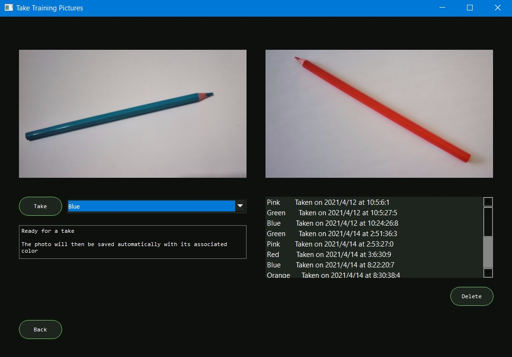

# C61-ProjetSynthese

>##Sommaire
>Le logiciel *Crayorescent* vous permet de :
> - Prendre des photos
> - Préparer des ensembles de données
> - Détecter une couleur

>##Installation
> Nécessite une caméra
> - Ouvrir le dossier *C61-ProjetSynthese* dans votre IDE préféré pour python 3.8.5 sous Windows 10. 
>> Visual Studio Code et PyCharm fonctionnent bien. PyCharm a l'avantage de souligner les erreurs dans le code, alors que pylint dans VS Code nous empêche de faire de même en raison d'une incompatibilité vis-à-vis PySide2 et PyQt5. 
> - Ouvrir le terminal. Exécuter *pip install PySide2* et *pip install qimage2ndarray*.
> - Ouvrir l'onglet du fichier DAO.py et inscrire le nom de votre base de données PostGreSQL, votre nom d'utilisateur et votre mot de passe.
> - Exécuter le script de création de tables *C61-ProjetSynthese-CarlGenest-PGSQL-Tables.sql* dans votre pgAdmin 4 de PostGreSQL.
> - Ouvrir l'onglet du fichier Main.py dans l'IDE et exécuter pour démarrer.

##Utilisation
>
> - Le menu principal est visible au démarrage. 
> - S'il s'agit de votre première utilisation, suivez les étapes dans l'ordre.
> - Après avoir choisi une option, vous pouvez faire *Back* pour revenir au menu principal.

>
> - Le premier bouton vous mène à la page suivante. Par défaut, le logiciel sélectionne la deuxième caméra disponible sur l'ordinateur. S'il n'y a pas de deuxième caméra, la première sera sélectionnée.
> - Faites dérouler les choix pour voir les couleurs acceptées et mettez un crayon de couleur de votre choix sur une feuille blanche devant votre caméra.
> - Assurez vous d'avoir choisi la bonne couleur dans le menu déroulant et d'avoir un éclairage suffisant.
> - Lorsque prêt, appuyez sur *Take*. La nouvelle photo sera enregistrée automatiquement dans la base de données. La couleur choisie et la date de prise devraient apparaitre dans la liste de droite.
> - Si vous cliquez sur un des objets de la liste, la photo correspondante devrait s'afficher dans le cadre au-dessus. Ayant sélectionné une photo, vous pouvez la supprimer en cliquant sur *Delete*.

>
> - Le deuxième bouton du menu principal vous mène ici. 
> - Faites dérouler les choix pour voir les couleurs présentes dans la base de données et choisissez-en une.
> - Vous verrez la liste des photos de cette couleur. Vous pouvez cliquer sur chacune d'entre elles pour voir si la couleur est bien captée par le logiciel. Si la couleur n'apparait pas, reprenez la photo avec un meilleur éclairage ou cliquez sur *Masks* pour ajuster les valeurs pouvant être captées (voir instructions plus bas).
> - Lorsque toutes les photos sont adéquates, cliquez sur *Create* pour créer un ensemble de données dans la base de données. Un ensemble contient les valeurs moyennes des pixels de la couleur de tous les crayons sur les photos. 
> - Cliquez sur un ensemble de données pour voir les données qu'il contient et supprimez les anciens ensembles au besoin.

>
> - Le troisième bouton du menu principal vous mène ici.
> - Placez un crayon de couleur devant la caméra sur une feuille blanche suffisamment éclairée. Après un court instant, l'application va vous donner la bonne couleur!
> - Sélectionnez un ensemble de données différent si vous voulez utiliser d'autres configurations. Par défaut, c'est le dernier ensemble qui sera sélectionné.

> - L'écran de modification des masques est accessible via la préparation des données lorsque vous avez choisi une couleur.
> - Il est recommandé de mettre plusieurs crayons de couleurs différentes devant la caméra sur une feuille blanche suffisamment éclairée. Cela permettra d'isoler la couleur sélectionnée.
> - Faites défiler les curseurs des barres de défilement jusqu'à ce que vous ne voyiez plus que la couleur choisie dans le premier cadre.  
> - Sauvegardez votre nouvelle configuration si le nouveau masque vous satisfait et allez revoir ce que le nouveau masque produit comme résultat sur l'ensemble des photos de la même couleur. 

##Références
Explications entourant le K-means utilisé par OpenCV: 
 https://docs.opencv.org/master/de/d4d/tutorial_py_kmeans_understanding.html
 Exemple de code du K-Means tel que fourni par OpenCV:
 https://docs.opencv.org/master/d1/d5c/tutorial_py_kmeans_opencv.html
 Intégration du live stream dans PySide2:
 https://stackoverflow.com/questions/44404349/pyqt-showing-video-stream-from-opencv/44404713
 Création de fenêtres dans PyQt/PySide:
 https://www.learnpyqt.com/tutorials/creating-multiple-windows/
 Ajustement des masques:
 https://www.youtube.com/watch?v=Tj4zEX_pdUg
 

##Contact
Carl Genest 
gnest@hotmail.ca

##Remerciements
Je remercie mon enseignant Jean-Christophe Demers qui a cru en moi et en ce projet.  
C'est vous qui m'avez inspiré ce projet par votre expérience en vision par ordinateur et votre travail en industrie.  
Pour nos belles discussions, encore merci,  
Que nos chemins puissent se recroiser dans l'avenir. 